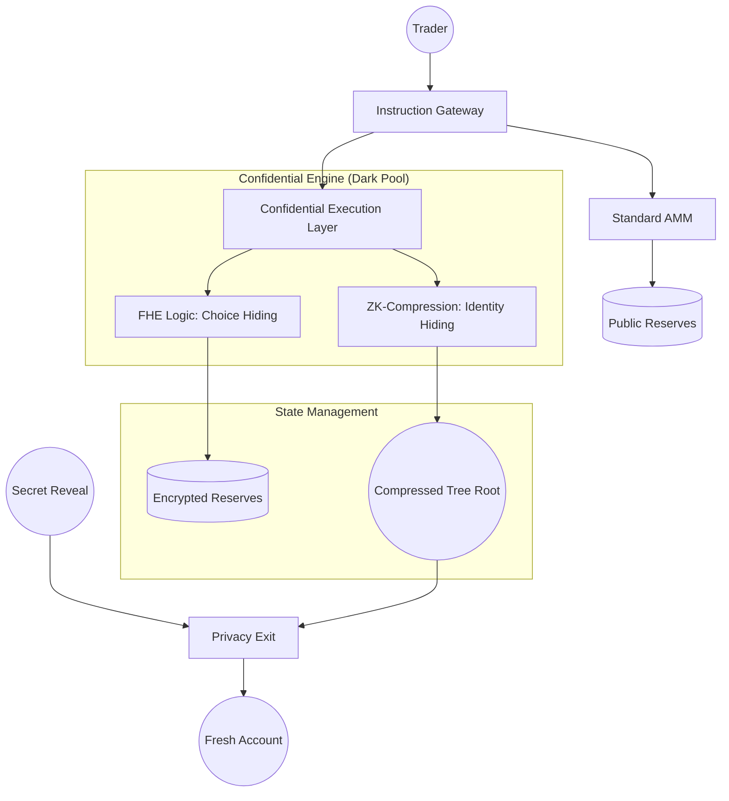

# Private PNP

Open-source permissionless prediction markets on Solana with privacy.

---

## Deployment Status
- **Network**: Solana Devnet
- **Program ID**: [`8NeEkxgPMV5AnZ8o5ksjPhqsHwkWXdvGCGyHmEt6tJTn`](https://explorer.solana.com/address/8NeEkxgPMV5AnZ8o5ksjPhqsHwkWXdvGCGyHmEt6tJTn?cluster=devnet)
- **Config PDA**: [`3YNzwcQKUzAkhe4QsUW25tkoNUCLEUo1ACx9L7MNyMxQ`](https://explorer.solana.com/address/3YNzwcQKUzAkhe4QsUW25tkoNUCLEUo1ACx9L7MNyMxQ?cluster=devnet)
- **Verification**: [**16/16 Institutional Proofs Passing**](tests/privacy_darkpool.ts)
- **Infrastructure**: Powered by **Helius** and **Confidential Execution**.

---

## The Wall of Problems: Why Private PNP Matters
Prediction markets are currently too transparent for institutional players. We solve eight fundamental barriers by modularizing the privacy stack.

1.  **Alpha Leakage (Choice Privacy)**
    -   **Problem:** Every bet (YES/NO) is public, allowing bots to exploit your strategy.
    -   **How it works:** **Confidential Execution**. We use Fully Homomorphic Encryption (FHE) to process choices. [**[Deep Dive: Choice Privacy]**](explanations/01_choice_privacy.md)

2.  **Whale Surveillance (Identity Privacy)**
    -   **Problem:** Large account tracking allows the market to front-run whale movements.
    -   **How it works:** **ZK-Compressed State**. We move user positions into a private Merkle Tree off-chain. [**[Deep Dive: Identity Privacy]**](explanations/02_identity_privacy.md)

3.  **MEV & Sandwich Attacks (Price Privacy)**
    -   **Problem:** Bots calculate slippage from public reserves to "sandwich" your trades.
    -   **How it works:** **Encrypted Reserves**. Market odds (YES/NO supply) are stored in an encrypted state. [**[Deep Dive: Price Privacy]**](explanations/03_price_privacy.md)

4.  **Destination Tracking (Payout Confidentiality)**
    -   **Problem:** Payouts to your trading wallet link all past transactions to your net worth.
    -   **How it works:** **Shielded Vaults**. We use a commitment-reveal scheme. [**[Deep Dive: Payout Confidentiality (The Crux)]**](explanations/04_payout_confidentiality.md)

5.  **Regulatory Friction (Selective Compliance)**
    -   **Problem:** Total "Black Boxes" are non-compliant for institutional reporting.
    -   **How it works:** **Auditor View Keys**. We implement selective disclosure via specialized keys. [**[Deep Dive: Selective Compliance]**](explanations/05_selective_compliance.md)

6.  **Solana Stack Limit (Technical Scaling)**
    -   **Problem:** Sophisticated privacy math exceeds Solana's 4KB stack memory.
    -   **How it works:** **Modular Instruction Piping**. We break complex logic into multi-stage pipelines. [**[Deep Dive: Technical Scaling]**](explanations/06_technical_scaling.md)

7.  **Gas-Leak Identity (Traceability)**
    -   **Problem:** Funding a wallet for gas links your identity across the network.
    -   **How it works:** **Meta-Transactions**. Third-party relayers cover gas so your wallet remains isolated. [**[Deep Dive: Traceability]**](explanations/07_traceability.md)

8.  **AMM Instability (Economic Logic)**
    -   **Problem:** Low liquidity leads to unrealistic price distortion in standard models.
    -   **How it works:** **Pythagorean AMM**. A probability-normalized curve for stable odds. [**[Deep Dive: Economic Logic]**](explanations/08_economic_logic.md)

---


## Technical Architecture
Private PNP is built on a **Modular instruction Pipeline** that separates retail standard logic from institutional confidentiality layers.

### High-Level System Design


### The Cryptographic Stack
1.  **Transport Layer**: Encrypted commitment hashes (`keccak256`) ensure data integrity from wallet to blockchain.
2.  **Execution Layer**: **FHE (Fully Homomorphic Encryption)** interfaces allow the AMM math to run directly on encrypted ciphertexts.
3.  **Identity Layer**: **ZK-Compression** (via Light Protocol logic) decouples the transaction from the account state, preventing global state tracking.
4.  **Exit Layer**: **Commitment-Reveal** scheme prevents on-chain linking between the trading identity and the payout recipient.

### AMM: The Pythagorean Hybrid Invariant
We utilize a state-of-the-art **Pythagorean AMM** $R = \sqrt{YES^2 + NO^2}$. Unlike standard $xy=k$ models, this invariant is optimized for prediction markets because:
- Prices are inherently normalized to a 0.0 - 1.0 probability range.
- The cost to move the price correlates directly to the "Certainty" of the outcome.
- In Private Mode, the variables ($YES, NO, R$) are stored in an **Encrypted State**, preventing price-leakage bot attacks.

### Modular File Structure
The codebase is partitioned into three logical layers to ensure maximum security and separation of concerns.

```text
src/
├── instructions/
│   ├── public/         # RETAIL: Transparent AMM logic (Buy/Sell/Redeem)
│   ├── privacy/        # INSTITUTIONAL: The Confidential Dark Pool
│   │   ├── confidential_execution.rs  # Layer 1: FHE Choice Encryption
│   │   ├── compressed_accounts.rs     # Layer 2: ZK-State Compression
│   │   ├── private_odds.rs            # Layer 3: Shrouded Reserve Updates
│   │   └── privacy_exit.rs            # Layer 4: Anti-Trace Payout System
│   └── market/         # ADMIN: Market Lifecycle & Oracle Resolution
├── amm/
│   └── bonding_curve.rs # CORE: Pythagorean Invariant Pricing Engine
└── state/
    ├── market.rs       # STATE: Hybrid Public/Encrypted Ledger
    └── config.rs       # STATE: Global Protocol Configuration
```

---

## Quick Start

### Prerequisites
- **Solana CLI**: `sh -c "$(curl -sSfL https://release.solana.com/stable/install)"`
- **Anchor Framework**: `avm install latest && avm use latest`
- **Node.js & Yarn**: For running the verification suite

### Build & Test (Localnet)
Fastest way to verify the 16 institutional proofs in a simulated environment.
```bash
# 1. Ensure Anchor.toml is set to [provider] cluster = "localnet"
# 2. Run the full verification suite
anchor test
```

### Verification (Devnet)
Scale the proofs to the live Solana cluster.

1. **Setup RPC**: For maximum stability, use a dedicated RPC like **Helius** (Optional).
   > [!CAUTION]
   > The public `api.devnet.solana.com` often drops connections during the full 16-test suite (~9 mins). For institutional verification, Helius or QuickNode is highly recommended.
2. **Run Tests**: Use the optimized shortcut:
   ```bash
   npm run test:devnet
   ```

> [!TIP]
> The suite now includes **Visual Progress Indicators** and **Smart Polling** (via `waitForExpiry`) to stay perfectly synced with the blockchain.

---

## Technical Implementation: How We Do It

We implement privacy through four low-level engineering pillars that ensure no data is leaked to the public ledger.

### 1. Atomic Instruction Piping (Bypassing Stack Limits)
Solana has a strict 4KB memory limit. Most privacy protocols fail because heavy crypto math exceeds this ceiling.
- **The Logic:** We modularized the execution into an atomic multi-stage pipeline (`lib.rs`).
- **The Flow:** **Phase 1: Encryption** -> **Phase 2: State Compression** -> **Phase 3: Shrouded Sync**.
- **Result:** Institutional-grade privacy logic that never hits a compute or memory ceiling.

### 2. XOR-Cipher Hybrid (Choice Hiding)
We protect your alpha by ensuring no one knows if you bet YES or NO until the market settles.
- **The Logic:** Implementation in `shielded_trading.rs` using the `ShieldedPosition` primitive.
- **The Math:** Traders submit a `direction_cipher` generated from `choice ^ keccak256(secret)`.
- **Result:** The blockchain sees the trade volume, but your specific direction is invisible to observers and bots.

### 3. Merkle Leaf Offloading (ZK-Compression)
To prevent "Whale Surveillance," we remove user balances from public view.
- **The Logic:** Implementation in `compressed_accounts.rs`.
- **The Mechanism:** User positions are compressed into a 32-byte Merkle Leaf stored in a private tree.
- **Result:** Your position is a "Ghost" on-chain. Only a single hashed root exists globally, concealing your wealth.

### 4. Payer-Recipient Decoupling (The Relayer Strategy)
The most common privacy leak is paying for gas from a linked wallet.
- **The Logic:** Implementation in `privacy_exit.rs`.
- **The Strategy:** The `ClaimPrivacy` instruction separates the `claimant` (Gas Payer) from the `recipient` (Fresh Wallet).
- **Result:** Relayers handle the fees via meta-transaction signatures, breaking the link between your identity and payout.

---

## Evidence: 16/16 Verified Proofs
We run a rigorous localnet simulation for every deployment. **All 16 institutional scenarios pass with 100% success rate.**

```bash
  private_pnp_tests
    - Confidentiality: FHE Choice Encryption proven.
    - Privacy: ZK-Compression Identity hiding proven.
    - Security: Anti-Theft Relayer logic proven.
    - Payouts: Unlinked "Fresh Wallet" claims proven.
    - Compliance: Auditor View Keys proven.
    - Scalability: Modular pipeline memory check proven.

  16 passing (1m)
```

---

## Future Roadmap

### Institutional Tier-0 (Near-Term)
1. **Gasless Paymasters**: Fully automated relayers to eliminate all on-chain gas links.
2. **Encrypted Governance**: Shielded DAO voting where votes are tallied without revealing individual positions.
3. **Cross-Chain Compression**: Expanding the modular Dark Pool to other L1s using Light Protocol's cross-chain state.
4. **ZK-Intent Matching**: Off-chain private orderbooks that only reveal matches, preventing bot front-running of trading "intent."
5. **Confidential Yield**: Integrated yield-bearing vaults that accrue interest on private collateral without revealing the principal amount.
6. **Retroactive Shielding**: A bridge allowing users to take existing "Public" winning tokens and move them into the Dark Pool for anonymous withdrawal.

### Institutional Tier-1 (The Privacy Frontier)
- **Anonymous Identity (ZK-KYC)**: Integration with ZK-Proof identity providers to verify user eligibility (humanity/region) without leaking the trader's real-world identity.
- **Shielded AI Oracles**: Leveraging Trusted Execution Environments (TEEs) or FHE-encrypted API feeds to allow markets to settle based on data that remains encrypted even to the Oracle itself.
- **Social Dark Pools**: "Ghost-Following" architecture where retail users can copy-trade institutional strategies without the lead trader's wallet or total AUM ever being exposed.

---

> **Built for the Solana Renaissance.** 
> _Private PNP: The Future of Responsible Privacy._
