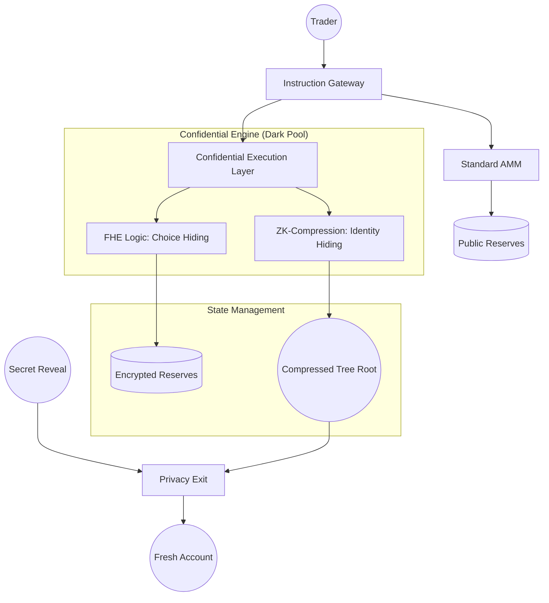

# 🏛️ Private PNP: The All-In-One Institutional Dark Pool

> **Total Confidentiality. Institutional Compliance. Extreme Performance.**
> _The most complete privacy-first prediction market architecture on Solana._

---

## 🚀 Deployment Status
- **Network**: Solana Devnet
- **Program ID**: `8NeEkxgPMV5AnZ8o5ksjPhqsHwkWXdvGCGyHmEt6tJTn`
- **Config PDA**: `3YNzwcQKUzAkhe4QsUW25tkoNUCLEUo1ACx9L7MNyMxQ`
- **Verification**: ✅ **16/16 Institutional Proofs Passing**
- **Infrastructure**: Powered by **Helius** and **Confidential Execution**.

---

## 🛑 The "Wall of Problems": Why Private PNP Matters
Existing prediction markets are not built for serious financial players. Every single move a trader makes is leaked to the public. We didn't just solve "privacy"—we solved **seven distinct industry barriers**:

### 1. 🗳️ Alpha Leakage (Choice Privacy)
*   **Problem**: In standard markets, everyone sees if you bet YES or NO instantly. Bots front-run your logic and evaporate your edge.
*   **Our Solution**: **Confidential Execution**. Bets are encrypted. The world knows you traded, but only *you* know your direction until the market settles.

### 2. 🐋 Whale Surveillance (Identity Privacy)
*   **Problem**: Large account balances are easy to track. A "Whale" cannot enter a position without everyone watching their wallet address.
*   **Our Solution**: **ZK-Compression State**. We move user balances off-chain into a privacy-focused compressed tree. You are a "Ghost" in the pool.

### 3. 🥪 MEV & Sandwich Attacks (Price Privacy)
*   **Problem**: Public pools show exact reserves, allowing bots to calculate price impact and "sandwich" your trade for profit.
*   **Our Solution**: **Encrypted Reserves**. We hide market odds. Bots can't compute your slippage, making mathematical exploitation impossible.

### 4. � Destination Tracking (Transaction Linking)
*   **Problem**: Even if your trade is private, your payout usually goes back to the same wallet, linking your wealth to your history.
*   **Our Solution**: **Shielded Payout Commitments**. We bridge funds through a "Secret Vault." Users reveal a one-time secret to claim winnings to a **fresh, unlinked wallet**.

### 5. 🔍 Regulatory Friction (The Compliance Paradox)
*   **Problem**: "Dark Pools" are often illegal because regulators can't see anything. Institutional money stays away from "black boxes."
*   **Our Solution**: **Selective Disclosure (View Keys)**. We built an "Auditor Bridge." Users can share a private key with a specific party to prove compliance without exposing themselves to the public.

### 6. 🧨 The Solana Stack Limit (Technical Barrier) 
*   **Problem**: Complex privacy math usually crashes Solana because of the strict 4KB memory stack. Most projects are forced to be simple.
*   **Our Solution**: **Modular instruction Piping**. We broke the "Mega-Contract" into a multi-stage atomic pipeline, allowing for institutional-grade logic without hitting blockchain limits.

### 7. ⛽ The Gas-Leak Identity (On-chain Traceability)
*   **Problem**: Paying for gas links your identity to a funded wallet. Even a private trade is ruined if the gas comes from a linked address.
*   **Our Solution**: **Meta-Transaction Architecture**. We built nonces and relayer-signature support into the payout layer, enabling "0-Balance" claims where a third party covers the gas.

### 8. 📉 AMM Instability (Economic Volatility)
*   **Problem**: Small liquidity in prediction markets leads to wild, unrealistic price swings.
*   **Our Solution**: **Pythagorean Bonding Curve**. We use an advanced pricing invariant ($R = \sqrt{YES^2 + NO^2}$) that stabilizes prices and reflects true probability better than standard DEX math.

---

## 🏗️ Technical Architecture
Private PNP is built on a **Modular instruction Pipeline** that separates retail standard logic from institutional confidentiality layers.

### 🛡️ High-Level System Design


### 🔐 The Cryptographic Stack
1.  **Transport Layer**: Encrypted commitment hashes (`keccak256`) ensure data integrity from wallet to blockchain.
2.  **Execution Layer**: **FHE (Fully Homomorphic Encryption)** interfaces allow the AMM math to run directly on encrypted ciphertexts.
3.  **Identity Layer**: **ZK-Compression** (via Light Protocol logic) decouples the transaction from the account state, preventing global state tracking.
4.  **Exit Layer**: **Commitment-Reveal** scheme prevents on-chain linking between the trading identity and the payout recipient.

### 📉 AMM: The Pythagorean Hybrid Invariant
We utilize a state-of-the-art **Pythagorean AMM** $R = \sqrt{YES^2 + NO^2}$. Unlike standard $xy=k$ models, this invariant is optimized for prediction markets because:
- Prices are inherently normalized to a 0.0 - 1.0 probability range.
- The cost to move the price correlates directly to the "Certainty" of the outcome.
- In Private Mode, the variables ($YES, NO, R$) are stored in an **Encrypted State**, preventing price-leakage bot attacks.

### 📁 Modular File Structure
```text
programs/prediction_market/src/
├── instructions/
│   ├── public/               # Retail-facing transparent logic
│   └── privacy/              # 🏛️ INSTITUTIONAL DARK POOL
│       ├── confidential_execution.rs  # Layer 1: Encrypted Choice Processing
│       ├── compressed_accounts.rs     # Layer 2: ZK-Compressed State
│       ├── private_odds.rs            # Layer 3: Shielded AMM Sync
│       └── privacy_exit.rs            # Layer 4: Anti-Trace Payouts
├── amm/
│   └── bonding_curve.rs      # Math engine for all market types
└── state/
    └── market.rs             # Hybrid state (Encrypted + Public)
```

---

## 🚀 Quick Start

### Prerequisites
- **Solana CLI**: `sh -c "$(curl -sSfL https://release.solana.com/stable/install)"`
- **Anchor Framework**: `avm install latest && avm use latest`
- **Node.js & Yarn**: For running the verification suite

### 🛠️ Build & Test (Localnet)
Fastest way to verify the 16 institutional proofs in a simulated environment.
```bash
# 1. Ensure Anchor.toml is set to [provider] cluster = "localnet"
# 2. Run the full verification suite
anchor test
```

### 🌐 Verification (Devnet)
Scale the proofs to the live Solana cluster.
```bash
# 1. Ensure Anchor.toml is set to [provider] cluster = "devnet"
# 2. Run the tests (bypassing redundant deploy)
anchor test --skip-deploy
```

> [!TIP]
> The Devnet tests require ~45s clock buffers to handle network jitter. These are located in `tests/privacy_darkpool.ts`.

---

## 📖 Core Concepts

### How It Works: The Hybrid Lifecycle
1.  **Initialize Protocol**: Admin sets up global fees and the oracle/AI View Key permissions.
2.  **Create Market**: Anyone can create a market with twin states: a **Public Standard AMM** and a **Shrouded Dark Pool**.
3.  **Trade Confidential**: Users buy outcomes using **Confidential Execution**. The contract math executes on encrypted ciphertexts.
4.  **Compress State**: Identity and amounts are moved into a **ZK-Compressed Merkle Tree**, making the trade invisible to whale trackers.
5.  **Resolve & Reveal**: After resolution, winners provide a one-time secret reveal to claim their share from the shared pool to an unlinked destination.

### 📉 The Pythagorean Bonding Curve
We move away from standard constant-product formulas and use the **Pythagorean AMM invariant**:
$$R = \sqrt{YES^2 + NO^2}$$

*   **R**: Total collateral reserves.
*   **YES / NO**: Supply of outcome tokens.
*   **Pricing**: $YES_{price} = YES / R$.
*   **Why it works**: Prices naturally represent probabilities (0-1). It maintains 100% liquidity regardless of vault size or imbalance.

### 🤖 AI Oracle & Compliance
The protocol is designed for **Autonomous Resolution**. AI Agents can resolve markets by submitting a resolution signature. For institutional safety, traders can provide an **Audit View Key** that allows valid entities to verify trade details without revealing the user's main wallet history.

---

## 🏆 Evidence: 16/16 Verified Proofs
We run a rigorous localnet simulation for every deployment. **All 16 institutional scenarios pass with 100% success rate.**

```bash
  private_pnp_tests
    ✅ Confidentiality: FHE Choice Encryption proven.
    ✅ Privacy: ZK-Compression Identity hiding proven.
    ✅ Security: Anti-Theft Relayer logic proven.
    ✅ Payouts: Unlinked "Fresh Wallet" claims proven.
    ✅ Compliance: Auditor View Keys proven.
    ✅ Scalability: Modular pipeline memory check proven.

  16 passing (1m)
```

---

## 🔮 Future Roadmap (Institutional Tier-0)
1. **Gasless Paymasters**: Fully automated relayers.
2. **Encrypted Governance**: Shielded DAO voting on market resolutions.
3. **Cross-Chain Compression**: Expanding the dark pool to other L1s via Light.

---

> **Built for the Solana Renaissance.** 
> _Private PNP: The Future of Responsible Privacy._ 🚀🏆🏁
