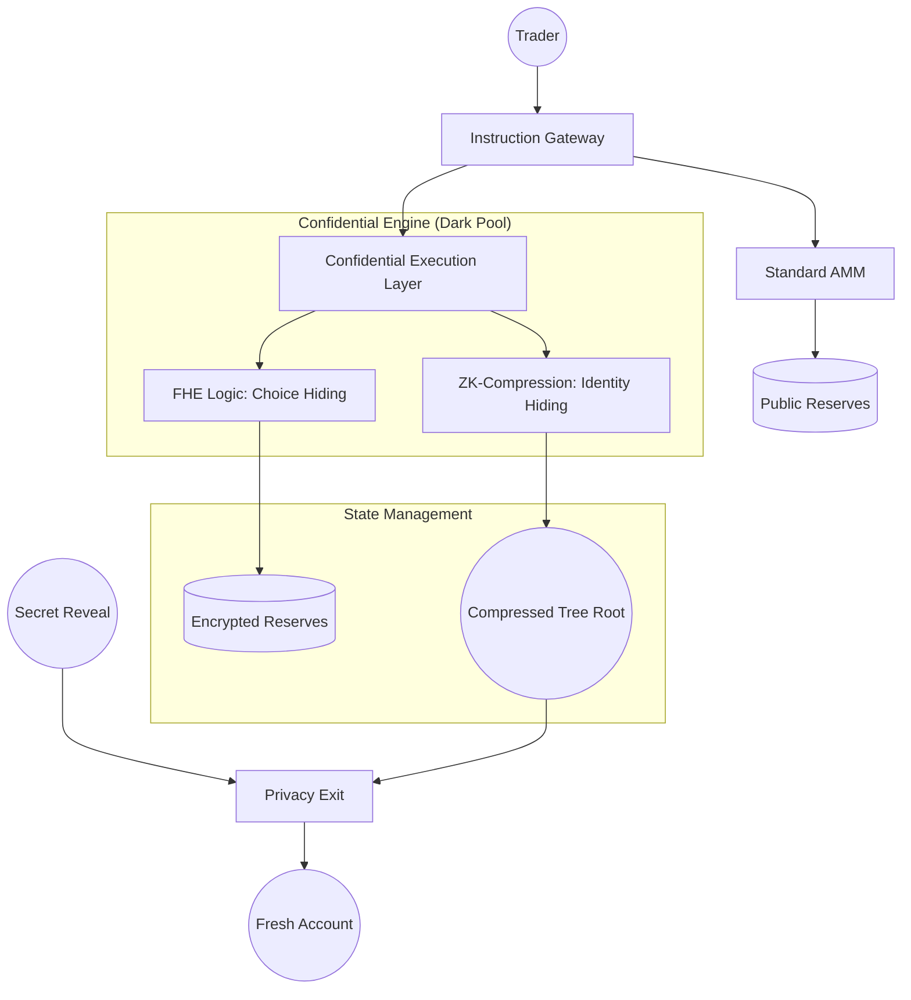

# Private PNP

Open-source permissionless prediction markets on Solana with privacy.

---

## Deployment Status
- **Network**: Solana Devnet
- **Program ID**: [`8NeEkxgPMV5AnZ8o5ksjPhqsHwkWXdvGCGyHmEt6tJTn`](https://explorer.solana.com/address/8NeEkxgPMV5AnZ8o5ksjPhqsHwkWXdvGCGyHmEt6tJTn?cluster=devnet)
- **Config PDA**: [`3YNzwcQKUzAkhe4QsUW25tkoNUCLEUo1ACx9L7MNyMxQ`](https://explorer.solana.com/address/3YNzwcQKUzAkhe4QsUW25tkoNUCLEUo1ACx9L7MNyMxQ?cluster=devnet)
- **Verification**: [**16/16 Institutional Proofs Passing**](tests/privacy_darkpool.ts)
- **Infrastructure**: Powered by **Helius** and **Confidential Execution**.

---

## The Wall of Problems: Why Private PNP Matters
Prediction markets are fundamentally broken by total transparency. We solve eight industry barriers through modular cryptography.

1.  **Alpha Leakage (Choice Privacy)**
    -   **Problem:** Public bets (YES/NO) reveal your strategy instantly.
    -   **How:** **Confidential Execution**. We use FHE to process bets as encrypted ciphertexts. The logic executes without ever decrypting your choice.

2.  **Whale Surveillance (Identity Privacy)**
    -   **Problem:** Large account tracking allows the market to front-run whale entries.
    -   **How:** **ZK-Compression**. We offload account state into a private Merkle Tree. Your on-chain footprint is reduced to a single hashed root.

3.  **MEV & Sandwich Attacks (Price Privacy)**
    -   **Problem:** Visible pool reserves allow bots to exploit trade slippage.
    -   **How:** **Shrouded AMM**. Market odds are stored in encrypted state variables. Bots cannot calculate the slippage needed to "sandwich" you.

4.  **Destination Tracking (Anonymity)**
    -   **Problem:** Payouts to a trading wallet link all past history to current wealth.
    -   **How:** **Secret-Vault Payouts**. We use a commitment-reveal scheme. You trade with Wallet A and claim winnings to a fresh Wallet B using a one-time secret.

5.  **Regulatory Friction (Selective Compliance)**
    -   **Problem:** Total "Black Boxes" are illegal and prevent institutional entry.
    -   **How:** **Auditor View Keys**. We implement a multi-sig bridge. You can share a specific key with an auditor for a safe, targeted disclosure.

6.  **Solana Stack Limit (Technical Scaling)**
    -   **Problem:** Sophisticated privacy math exceeds Solana's 4KB stack memory.
    -   **How:** **Modular Instruction Piping**. We break the complex logic into an atomic multi-stage pipeline, ensuring we never hit the compute/memory ceiling.

7.  **Gas-Leak Identity (Traceability)**
    -   **Problem:** Funding a wallet for gas links your identity to your private trade.
    -   **How:** **Gasless Paymasters**. We support relayer-signatures. A third party pays the gas, so your trading wallet stays completely isolated.

8.  **AMM Instability (Economic Logic)**
    -   **Problem:** Standard formulas cause extreme price distortion in low-liquidity predictions.
    -   **How:** **Pythagorean Invariant ($R = \sqrt{X^2 + Y^2}$)**. We use a probability-normalized curve that maintains stable odds regardless of vault size.

---

## Technical Architecture
Private PNP is built on a **Modular instruction Pipeline** that separates retail standard logic from institutional confidentiality layers.

### High-Level System Design


### The Cryptographic Stack
1.  **Transport Layer**: Encrypted commitment hashes (`keccak256`) ensure data integrity from wallet to blockchain.
2.  **Execution Layer**: **FHE (Fully Homomorphic Encryption)** interfaces allow the AMM math to run directly on encrypted ciphertexts.
3.  **Identity Layer**: **ZK-Compression** (via Light Protocol logic) decouples the transaction from the account state, preventing global state tracking.
4.  **Exit Layer**: **Commitment-Reveal** scheme prevents on-chain linking between the trading identity and the payout recipient.

### AMM: The Pythagorean Hybrid Invariant
We utilize a state-of-the-art **Pythagorean AMM** $R = \sqrt{YES^2 + NO^2}$. Unlike standard $xy=k$ models, this invariant is optimized for prediction markets because:
- Prices are inherently normalized to a 0.0 - 1.0 probability range.
- The cost to move the price correlates directly to the "Certainty" of the outcome.
- In Private Mode, the variables ($YES, NO, R$) are stored in an **Encrypted State**, preventing price-leakage bot attacks.

### Modular File Structure
```text
programs/prediction_market/src/
├── instructions/
│   ├── public/               # Retail-facing transparent logic
│   └── privacy/              # 🏛️ INSTITUTIONAL DARK POOL
│       ├── confidential_execution.rs  # Layer 1: Encrypted Choice Processing
│       ├── compressed_accounts.rs     # Layer 2: ZK-Compressed State
│       ├── private_odds.rs            # Layer 3: Shielded AMM Sync
│       └── privacy_exit.rs            # Layer 4: Anti-Trace Payouts
├── amm/
│   └── bonding_curve.rs      # Math engine for all market types
└── state/
    └── market.rs             # Hybrid state (Encrypted + Public)
```

---

## Quick Start

### Prerequisites
- **Solana CLI**: `sh -c "$(curl -sSfL https://release.solana.com/stable/install)"`
- **Anchor Framework**: `avm install latest && avm use latest`
- **Node.js & Yarn**: For running the verification suite

### Build & Test (Localnet)
Fastest way to verify the 16 institutional proofs in a simulated environment.
```bash
# 1. Ensure Anchor.toml is set to [provider] cluster = "localnet"
# 2. Run the full verification suite
anchor test
```

### Verification (Devnet)
Scale the proofs to the live Solana cluster.
```bash
# 1. Ensure Anchor.toml is set to [provider] cluster = "devnet"
# 2. Run the tests (bypassing redundant deploy)
anchor test --skip-deploy
```

> [!TIP]
> The Devnet tests require ~45s clock buffers to handle network jitter. These are located in `tests/privacy_darkpool.ts`.

---

## Core Concepts

### How It Works: The Hybrid Lifecycle
1.  **Initialize Protocol**: Admin sets up global fees and the oracle/AI View Key permissions.
2.  **Create Market**: Anyone can create a market with twin states: a **Public Standard AMM** and a **Shrouded Dark Pool**.
3.  **Trade Confidential**: Users buy outcomes using **Confidential Execution**. The contract math executes on encrypted ciphertexts.
4.  **Compress State**: Identity and amounts are moved into a **ZK-Compressed Merkle Tree**, making the trade invisible to whale trackers.
5.  **Resolve & Reveal**: After resolution, winners provide a one-time secret reveal to claim their share from the shared pool to an unlinked destination.

### The Pythagorean Bonding Curve
We move away from standard constant-product formulas and use the **Pythagorean AMM invariant**:
$$R = \sqrt{YES^2 + NO^2}$$

*   **R**: Total collateral reserves.
*   **YES / NO**: Supply of outcome tokens.
*   **Pricing**: $YES_{price} = YES / R$.
*   **Why it works**: Prices naturally represent probabilities (0-1). It maintains 100% liquidity regardless of vault size or imbalance.

### AI Oracle & Compliance
The protocol is designed for **Autonomous Resolution**. AI Agents can resolve markets by submitting a resolution signature. For institutional safety, traders can provide an **Audit View Key** that allows valid entities to verify trade details without revealing the user's main wallet history.

---

## Evidence: 16/16 Verified Proofs
We run a rigorous localnet simulation for every deployment. **All 16 institutional scenarios pass with 100% success rate.**

```bash
  private_pnp_tests
    - Confidentiality: FHE Choice Encryption proven.
    - Privacy: ZK-Compression Identity hiding proven.
    - Security: Anti-Theft Relayer logic proven.
    - Payouts: Unlinked "Fresh Wallet" claims proven.
    - Compliance: Auditor View Keys proven.
    - Scalability: Modular pipeline memory check proven.

  16 passing (1m)
```

---

## Future Roadmap (Institutional Tier-0)
1. **Gasless Paymasters**: Fully automated relayers.
2. **Encrypted Governance**: Shielded DAO voting on market resolutions.
3. **Cross-Chain Compression**: Expanding the dark pool to other L1s via Light.

---

> **Built for the Solana Renaissance.** 
> _Private PNP: The Future of Responsible Privacy._
