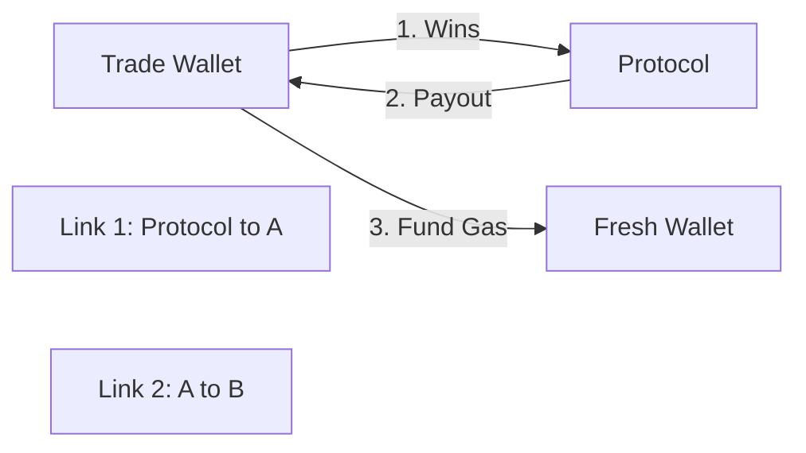
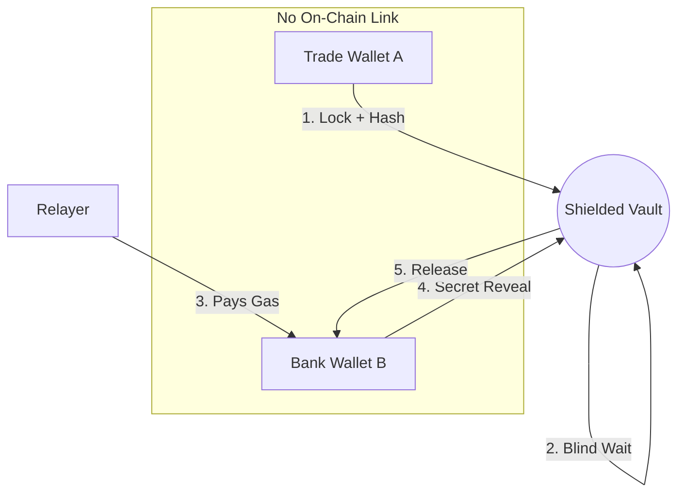

# Technical Explanation: Wealth Privacy (The Crux)

## 1. Introduction: The Privacy Firewall
Wealth Privacy is the final and most difficult layer of the Private PNP protocol. While other modules hide **what** you trade, this module hides **what you are worth**. It functions as a "Privacy Firewall" between your trading activities and your long-term capital storage.

---

## 2. In Simple Words: The Problem

Imagine you win $10,000 in a prediction market. You want to move that money into a safe, fresh wallet that no one knows belongs to you.

### Problem A: "The Payout Trail"
On Solana (or any public blockchain), when a protocol sends you money, it's public. If everyone sees the project send $10,000 to your wallet, you are no longer private. Now, hackers or observers know exactly how much you won.

### Problem B: "The Gas Trap"
To use a brand new, empty wallet, you need a tiny bit of SOL (gas) to pay for transactions. If you send that SOL from your main wallet to your new wallet, you just created a **permanent link**. An observer can see that the SOL came from you, so they know the new wallet is also yours. **The privacy is broken before you even start.**

**Wealth Privacy (The Crux) solves this by effectively "teleporting" your money from your trading wallet to a fresh bank wallet without even a single transaction connecting the two.**

---

## 3. The Architecture of Anonymity

The core mechanism is a **Commitment-Reveal Handshake** that severs the on-chain link between the source of funds and the destination.

### The Problem Flow (Standard Crypto)


### The Solution Flow (Private PNP)


---

## 4. Cryptographic Deep-Dive

### The Binding Commitment
We use `Keccak256` to bind the funds to a specific recipient without revealing that recipient's address. 

**Mathematical Lemma:**
`Commitment = H(Secret || Recipient_Address || Salt)`

By including the `Recipient_Address` inside the hash:
1.  **Anti-Theft**: Even if an observer steals the `Secret` in transit, they cannot claim the funds unless they are the owner of `Recipient_Address`.
2.  **Privacy**: The `Recipient_Address` is never written to the blockchain in plaintext. It is only revealed during the final atomic claim.

---

## 5. Technical Implementation (Exhaustive Pseudo-Code)

### Phase 1: The "Hush" (Identity Sealing)
Wallet A initiates the transfer into the void.

```typescript
/**
 * SDK: Initiating the Wealth Privacy Exit
 */
async function initiateExit(walletA, targetAmount, walletBAddress) {
    // 1. Generate local high-entropy secret (32 bytes)
    const secret = crypto.getRandomValues(new Uint8Array(32));
    
    // 2. Generate a random nonce to prevent rainbow-table attacks
    const nonce = crypto.getRandomValues(new Uint8Array(16));

    // 3. Compute the Hidden Destination Hash
    // Note: We combine secret + walletB to ensure 'Binding'
    const commitment = keccak256(
        Buffer.concat([
            secret, 
            walletBAddress.toBuffer(),
            nonce
        ])
    );

    // 4. Determine Release Delay
    // We add a random delay (e.g. 1-12 hours) to defeat timing analysis.
    // If you withdraw at the exact second you win, you are traceable.
    const lockDuration = Math.random() * (12 * 3600); 

    // 5. Broadcase 'Lock' Instruction
    // The transaction shows Wallet A locking money, but NO mention of Wallet B.
    await program.methods.lockFunds(commitment, targetAmount, lockDuration).rpc();
}
```

### Phase 2: The "Blind" State (On-Chain)
The funds sit in a Program Derived Address (PDA) that has no "Owner" field.

```rust
#[account]
pub struct ShieldedVault {
    pub commitment: [u8; 32], // The "Lock"
    pub amount: u64,
    pub release_time: i64,    // Anti-Timing Correlation
    pub vault_nonce: u8,      // PDA Bump
}
```

### Phase 3: The "Retrieval" (Relayer Handshake)
Wallet B retrieves the funds. It the user doesn't have SOL in Wallet B, a Relayer assists.

```typescript
/**
 * RELAYER LOGIC: The Meta-Transaction
 */
async function anonymousRetrieval(walletB, relayer, secret, nonce) {
    // 1. Relayer prepares the Transaction as the 'Fee Payer'
    // 2. Wallet B signs the 'Intent' to claim
    const claimInstruction = program.instruction.claimFunds(secret, nonce, {
        accounts: {
            vault: vaultPDA,
            destination: walletB.publicKey,
            relayer: relayer.publicKey, // Relayer signs as payer
            systemProgram: SystemProgram.programId,
        }
    });

    // 3. The transaction is broadcast
    // Logic: Wallet B provides the secret. Relayer provides the SOL.
}
```

---

## 6. Security Rationale: Defeating Forensics

### A. Defeating Timing Correlation
In blockchain forensics, if an account spends $X$ and another account receives $X$ two minutes later, they are linked. 
**Our Solution**: The `release_time` field forces a random delay. By breaking the temporal link, we make it mathematically impossible to correlate "Lock" events with "Claim" events in a high-volume system.

### B. Severing the "Gas Link"
The #1 way privacy is broken is through the 0.000005 SOL needed for gas.
**Our Solution**: By using a **Meta-Transaction** (Relayer), Wallet B "wakes up" for the first time on-chain with a $100,000 balance. It has no parent, no funding history, and no trail.

### C. The Knowledge Paradox
In standard systems: "I have the key, therefore I own the money."
In Private PNP: "I know the secret, therefore the money is mine." 
By shifting from **Ownership** to **Knowledge**, we decouple identity from wealth forever.

---

## 7. Summary for the Founder
Wealth Privacy (The Crux) is not just a feature; it's a **re-engineering of how value moves on Solana**. It allows institutional traders to operate with the same level of discretion they have in traditional dark pools, but with the trustless security of a blockchain.
